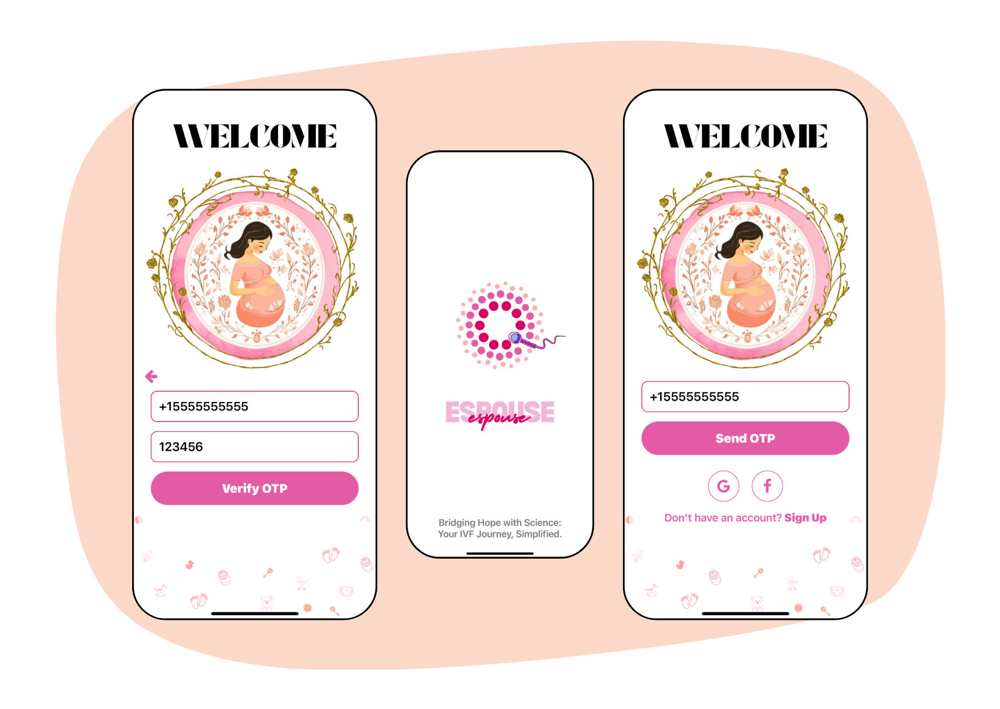

# 💖 Espouse – A solution to IVF Patients, Doctors, Gyanecologists and Embryologists. 

**Espouse** is a comprehensive health app designed to empower women through every stage of their reproductive journey. From period tracking to AI-assisted embryo grading and expert consultations, Espouse merges intuitive design with cutting-edge tech for a truly personalized experience.

---

## 📖 Table of Contents

- [About](#about)
- [Features](#features)
- [Tech Stack](#tech-stack)
- [Getting Started](#getting-started)
- [Usage](#usage)
- [Screenshots](#screenshots)
- [Roadmap](#roadmap)
- [Contributing](#contributing)
- [License](#license)
- [Contact](#contact)

---

## 📃 About

Espouse is more than just a period tracker — it's your all-in-one reproductive health assistant. Whether you're a wellness seeker, a gynecologist, or an embryologist, Espouse delivers a curated experience tailored to your role. With features like report sharing, AI-based embryo grading, and pro features for free, Espouse bridges the gap between users and specialists.

---

## ✨ Features

- 🩸 Track periods, symptoms & reproductive health  
- 🌐 Role-based experience for patients, gynecologists & embryologists  
- 🔐 Firebase email/password authentication  
- ☁️ Sync data with backend (MongoDB)  
- 📊 Insightful dashboards & health reports  
- 🤖 AI-based embryo grading (in progress)  
- 🎯 3D role selector & onboarding flow  
- 🌓 Light/Dark mode toggle  
- 📥 Report upload & viewing (coming soon)

---

## 🛠 Tech Stack

- **Frontend:** React Native (Expo)  
- **Backend:** Node.js + Express  
- **Database:** MongoDB  
- **Authentication:** Firebase  
- **3D Rendering:** Three.js  
- **Storage:** AsyncStorage (temporary)  
- **State Management:** AppContext + React hooks

---

## 🚀 Getting Started

### Prerequisites

- Node.js and npm
- Expo CLI  
  Install globally if not already:
```bash
  npm install -g expo-cli
```
- MongoDB Atlas account
- Firebase Project setup


### Installation

```bash
git clone https://github.com/your-username/Espouse.git
cd Espouse
npm install
npx expo start
```

### Usage
	•	Run the app in Expo Go on your mobile device
	•	Create an account or log in using email/password
	•	Complete the onboarding flow
	•	Access your dashboard, track cycles, and view reports
	•	Switch roles and experiences based on your profession


## Screenshots

### Branding & Login Screens


### Profile Setup Screens


⸻

## Roadmap
	•	Onboarding flow with 3D role selector
	•	Profile setup with country & name
	•	Navigation bar with animated icons
	•	Firebase Auth + AsyncStorage
	•	MongoDB integration for full data storage
	•	Report uploads by doctors
	•	Chat feature with specialists
	•	AI embryo grading module
	•	Web version of Espouse

⸻

## Contributing

We welcome contributions!
	1.	Fork the repository
	2.	Create a new branch (git checkout -b feature-name)
	3.	Make your changes and commit (git commit -m 'Add feature')
	4.	Push to the branch (git push origin feature-name)
	5.	Open a Pull Request

⸻

### License

Distributed under the MIT License. See LICENSE for more information.

⸻

### Contact

Espouse Development Team
📧 trock3338@gmail.com
🔗 www.linkedin.com/in/aman-singhall

Project Repository: https://github.com/your-username/Espouse
